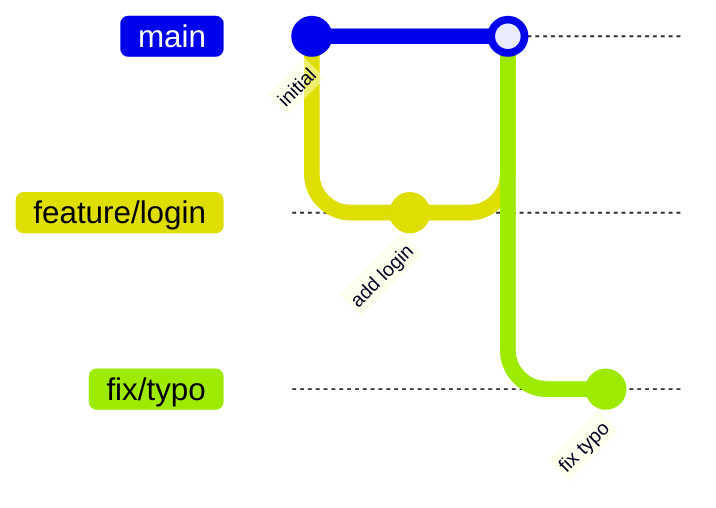

# git-branches

A **GitHub Copilot skill** that analyzes the branches in a git repository and produces a concise cleanup report with actionable recommendations.

## What It Does

When you invoke this skill, Copilot will:

1. **List all branches** — local and remote, sorted by last-commit date
2. **Check merge status** — detect branches already merged into `main`/`master` (including squash-merged and cherry-picked branches)
3. **Visualize branch relationships** — generate a [Mermaid](https://mermaid.js.org/) `gitGraph` diagram
4. **Report unique commits** — how many commits each branch has that are not in the default branch
5. **Produce a recommendation table** — one row per branch with a clear action:
   - ✅ **Keep** — active or default branch
   - 🗑️ **Delete (merged)** — fully merged; safe to delete
   - 🔀 **Merge first** — has unmerged work; review before deleting
   - ⚠️ **Review** — stale (90+ days inactive) or squash-merged; needs manual verification

## How to Use

Ask Copilot one of the following:

- _"Analyze the branches in this repository"_
- _"Give me a branch cleanup report"_
- _"Which branches can I delete?"_
- _"Show me the git branch status"_

Copilot will run the analysis and respond with a full Markdown report including the branch table, Mermaid diagram, and ready-to-run `git` commands for deleting merged branches.

## Example Output

### Branch Overview Table

| Branch | Last Commit | Author | Ahead | Behind | Merged? | Recommendation |
|--------|-------------|--------|-------|--------|---------|----------------|
| `main` | 2024-01-15 | Alice | — | — | ✅ default | ✅ Keep |
| `feature/login` | 2024-01-14 | Bob | 0 | 2 | ✅ Yes | 🗑️ Delete (merged) |
| `fix/typo` | 2023-11-01 | Carol | 3 | 12 | ❌ No | ⚠️ Review (stale) |
| `feature/payments` | 2024-01-10 | Dave | 5 | 1 | ❌ No | 🔀 Merge first |

### Mermaid Branch Visualization



### Delete Commands

```bash
# Delete local merged branches
git branch -d feature/login

# Delete remote merged branches
git push origin --delete feature/login
```

## Skill Definition

The skill behavior is defined in [`SKILL.md`](./SKILL.md).
