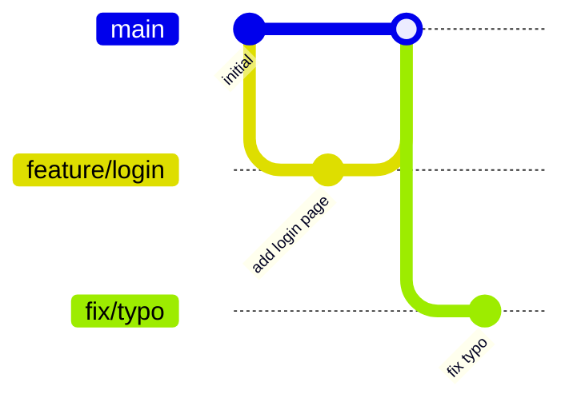

# Git Branch Insight Skill

This skill analyzes the branches of a git repository and produces a cleanup report. It uses git commands to inspect branch status, commit history, and merge relationships, then presents the findings in a clear table with actionable recommendations.

## How to Use

Invoke this skill by asking something like:

- "Analyze the branches in this repository"
- "Give me a branch cleanup report"
- "Which branches can I delete?"
- "Show me the git branch status"

## What This Skill Does

When invoked, the skill will:

1. **List all branches** — both local and remote branches with their last-commit dates
2. **Check merge status** — determine whether each branch has been merged into `main` or `master`
3. **Identify stale branches** — flag branches with no recent activity
4. **Visualize branch relationships** — render a Mermaid diagram of the branch topology
5. **Check unique commits** — show how many commits each branch has that are not in `main`/`master`
6. **Produce a recommendation table** — one row per branch with advice: `✅ Keep`, `🗑️ Delete (merged)`, `⚠️ Review`, or `🔀 Merge first`

---

## Instructions for the AI

When this skill is invoked, follow the steps below precisely.

### Step 1 — Identify the default branch

Run the following to find the default branch (`main` or `master`):

```bash
git remote show origin | grep 'HEAD branch' | awk '{print $NF}'
```

If there is no remote, fall back to:

```bash
git symbolic-ref --short HEAD
```

Store the result as `DEFAULT_BRANCH`.

### Step 2 — List all branches with metadata

Run the following command to collect branch data:

```bash
git --no-pager branch -a --sort=-committerdate \
  --format='%(refname:short)|%(committerdate:short)|%(authorname)|%(subject)'
```

For each branch, also capture the number of commits ahead of `DEFAULT_BRANCH`:

```bash
git --no-pager rev-list --count DEFAULT_BRANCH..BRANCH_NAME
```

And the number of commits behind `DEFAULT_BRANCH`:

```bash
git --no-pager rev-list --count BRANCH_NAME..DEFAULT_BRANCH
```

### Step 3 — Check merge status

For each branch that is not `DEFAULT_BRANCH`, check whether it is already merged:

```bash
git --no-pager branch -a --merged DEFAULT_BRANCH
```

A branch listed in the output of this command is **fully merged** into `DEFAULT_BRANCH`.

Also check for cherry-picked or squash-merged branches by comparing the diff:

```bash
git --no-pager diff DEFAULT_BRANCH...BRANCH_NAME -- | wc -l
```

If the diff is empty (0 lines) **and** the branch has commits ahead of the default branch **and** it is not listed as merged, the branch content may have been squash-merged or cherry-picked.

### Step 4 — Collect recent log for each branch

For each non-default branch, show the last 5 commits not in `DEFAULT_BRANCH`:

```bash
git --no-pager log DEFAULT_BRANCH..BRANCH_NAME \
  --oneline | head -5
```

### Step 5 — Generate a Mermaid diagram

Build a Mermaid `gitGraph` diagram to visualize branch relationships.

Use the following git command to collect the commit graph data:

```bash
git --no-pager log --oneline --graph --decorate --all | head -50
```

Then translate this into a Mermaid `gitGraph` diagram. Keep it concise — show only the most recent 20 commits across all branches. Example format:



If the repository has many branches, include only the most recently active ones (top 10 by last-commit date).

### Step 6 — Produce the report

Output the full report in Markdown using this structure:

---

## 📊 Git Branch Cleanup Report

**Repository:** `<repo name>`
**Default branch:** `<DEFAULT_BRANCH>`
**Report date:** `<today's date>`
**Total branches:** `<count>` (local: `<n>`, remote: `<n>`)

---

### Branch Overview Table

| Branch | Last Commit | Author | Ahead | Behind | Merged? | Recommendation |
|--------|-------------|--------|-------|--------|---------|----------------|
| `main` | 2024-01-15 | Alice | — | — | ✅ default | ✅ Keep |
| `feature/login` | 2024-01-14 | Bob | 0 | 2 | ✅ Yes | 🗑️ Delete (merged) |
| `fix/typo` | 2023-11-01 | Carol | 3 | 12 | ❌ No | ⚠️ Review (stale) |
| `feature/payments` | 2024-01-10 | Dave | 5 | 1 | ❌ No | 🔀 Merge first |

**Legend:**
- ✅ **Keep** — active branch or default branch
- 🗑️ **Delete (merged)** — branch is fully merged into the default branch; safe to delete
- 🔀 **Merge first** — branch has unmerged commits; review and merge before deleting
- ⚠️ **Review** — branch is stale (no commits in 90+ days) or content may have been squash-merged; needs manual review

---

### 🔀 Mermaid Branch Visualization


---

### 🗑️ Safe to Delete (merged branches)

List branches that are fully merged and can be deleted immediately:

```bash
# Delete local merged branches
git branch -d <branch1> <branch2> ...

# Delete remote merged branches
git push origin --delete <branch1> <branch2> ...
```

### ⚠️ Branches Requiring Review

For each branch that is not clearly merged, provide:

- Branch name
- Last commit date and author
- Number of unique commits
- A brief summary of the last commit message

### 📈 Summary

| Category | Count |
|----------|-------|
| Total branches | n |
| Safe to delete (merged) | n |
| Needs review (stale/squash-merged) | n |
| Active (unmerged work) | n |
| Default branch | 1 |

---

## Recommendation Logic

Use the following rules to assign recommendations:

| Condition | Recommendation |
|-----------|---------------|
| Branch == default branch | ✅ Keep |
| Branch is in `git branch --merged` | 🗑️ Delete (merged) |
| Branch diff vs default is 0 lines AND branch has commits ahead > 0 AND branch not in `--merged` | 🗑️ Delete (likely squash-merged) |
| Branch last commit > 90 days ago AND not merged | ⚠️ Review (stale) |
| Branch has commits ahead of default AND last commit < 90 days | 🔀 Merge first |
| Branch has commits ahead of default AND last commit > 90 days | ⚠️ Review (stale, unmerged) |

## Notes

- Remote branches (prefixed with `remotes/` or `origin/`) are included in the analysis.
- Skip branches like `HEAD` or detached HEAD references.
- If the repository is very large (100+ branches), limit the Mermaid diagram to the 10 most recently active branches but still include all branches in the table.
- Be concise: the goal is to help the team quickly decide which branches to clean up.
